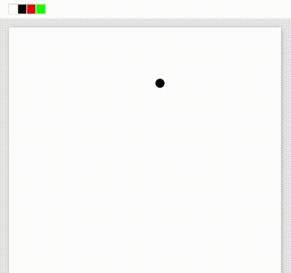
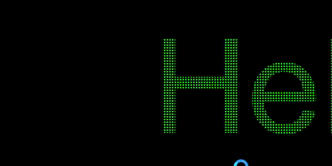
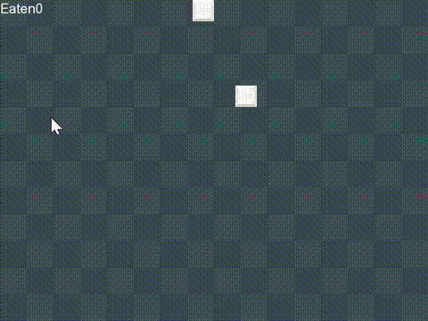

# C++ / SFML 基礎專案

使用 C++ 與 [SFML](https://www.sfml-dev.org/) 函式庫完成的圖形化小專案。

## 開發環境

- 語言：C++
- 函式庫：SFML 2.x
- IDE：Visual Studio 2022
- 平台：Windows x64

---

## 專案列表

### 1. Painter — 繪圖程式

簡易的畫布程式，可用滑鼠在視窗上自由繪圖。

**功能：**
- 按住左鍵拖曳以繪製圖案
- 點擊左上角色塊切換筆刷顏色（白／黑／紅／綠）
- 按 `S` 鍵將畫布儲存為 `canvas.png`

---

### 2. ScrollingText — 捲動文字

在視窗中顯示橫向捲動的文字，可即時調整方向與速度。

**功能：**
- `←` / `→`：切換捲動方向
- `1`–`5` 或 `S` / `F`：調整捲動速度（共 5 段）

---

### 3. SnakeGame — 貪吃蛇遊戲

經典貪吃蛇，吃滿 10 個食物即可過關。

**功能：**
- 方向鍵控制蛇的移動方向
- 吃到食物會變長，吃到第 3 及第 6 個時自動加速
- 撞牆或咬到自己為失敗，按任意鍵重新開始
- 吃滿 10 個顯示過關畫面

---

## 如何執行

1. 安裝 SFML 2.x（建議透過 [vcpkg](https://github.com/microsoft/vcpkg)）
2. 使用 Visual Studio 開啟對應的 `.sln` 檔
3. 建置並執行
