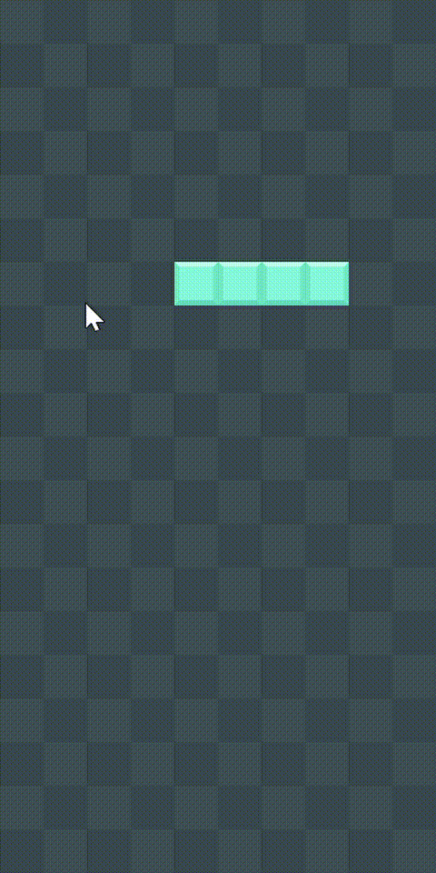

# TetrisGame 俄羅斯方塊

使用 C++ 與 SFML 製作的俄羅斯方塊遊戲。

## 示範

## 技術

- 語言：C++
- 函式庫：SFML 2.x
- IDE：Visual Studio 2022

## 操作方式

- `←` / `→`：左右移動方塊
- `↓`：加速下落
- `↑`：旋轉方塊
- 填滿一行自動消除

## 目前支援方塊

- O 型（黃色）
- I 型（淺藍色）

## 如何執行

1. 安裝 SFML 2.x（建議透過 [vcpkg](https://github.com/microsoft/vcpkg)）
2. 使用 Visual Studio 開啟 `TetrisGame.sln`
3. 建置並執行
