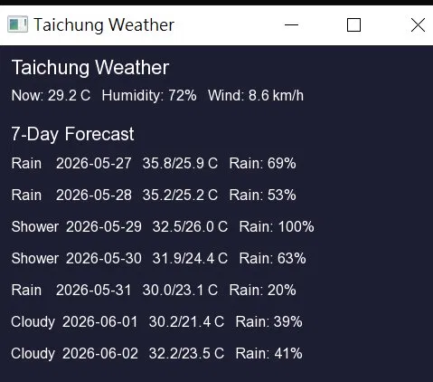

# Weather 台中天氣

使用 C++ 與 SFML 製作的天氣查詢程式，串接 [Open-Meteo API](https://open-meteo.com/) 取得台中即時天氣與 7 天預報。

## 示範



## 技術

- 語言：C++
- 函式庫：
  - SFML 2.6.1（圖形介面）
  - [cpp-httplib](https://github.com/yhirose/cpp-httplib)（HTTP 請求）
  - [nlohmann/json](https://github.com/nlohmann/json)（JSON 解析）
- IDE：Visual Studio 2022

## 功能

- 即時氣溫、濕度、風速
- 未來 7 天高低溫、降雨機率、天氣狀態

## 資料來源

[Open-Meteo](https://open-meteo.com/) — 免費且不需 API key 的開放氣象資料 API。

## 如何執行

1. 安裝 SFML 2.6.1 至 `C:\SFML-2.6.1`
2. 透過 vcpkg 安裝相依套件：
   ```
   vcpkg install cpp-httplib:x64-windows
   vcpkg install nlohmann-json:x64-windows
   ```
3. 使用 Visual Studio 開啟 `Weather.sln`
4. 建置並執行
